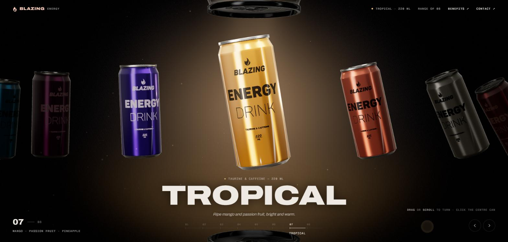

# Blazing Energy

An experimental, cinematic 3D energy drink landing page built with JavaScript and Three.js. The full
product range is rendered in real time in the browser and presented as an interactive display you can
drag, scroll and step through. It is a personal concept project, not a real brand or product.

## Live Demo

**[blazing-energy.vercel.app](https://blazing-energy.vercel.app/)**

## About

- Cinematic 3D product presentation — real-time WebGL, no pre-rendered product images
- Interactive product experience: drag, scroll, arrow keys and click-to-focus
- Scroll-driven transitions between products, with a commit threshold so small gestures spring back
- A studio light rig that re-colours itself to the active flavour
- Custom visual effects: layered atmospheric background, depth-sorted particles, a close-up product viewer
- Responsive layout, keyboard support and `prefers-reduced-motion` support

## Inspiration

Concept and visual direction were inspired by the
[Blazing Energy project by Yildiz Dikme](https://blazing-energy.netlify.app/)
([@YildizDikme](https://github.com/YildizDikme)). I rebuilt and adapted the idea into my own
implementation, visual system, interactions and presentation.

This is an independent reinterpretation. The original creator was not involved in this repository and
it is not a collaboration.

## Tech

- JavaScript
- Three.js
- WebGL / GLSL
- HTML
- CSS

## Representative Source

The complete implementation is kept private. This repository includes a small representative source
example to demonstrate the JavaScript/Three.js approach without exposing the full project source.

**[`src/example.js`](./src/example.js)** — a simplified sketch of the scene setup, studio light rig,
carousel layout and the spring-damped scroll interaction.

It is intentionally incomplete. The product model, printed artwork, HDR environment, custom shaders,
per-material lighting channels, particle system and page transitions are not included.

## Credits

- Concept inspiration — [Blazing Energy by Yildiz Dikme](https://blazing-energy.netlify.app/)
- Can model — "Energy Drink Game Ready Model" by **dwalsh**, licensed CC BY 4.0
- Noise transition and HDR environment — derived from the **Codrops** `codrops-noise-transition` demo
- Classic Perlin 4D noise (GLSL) — **Stefan Gustavson**
- [three.js](https://github.com/mrdoob/three.js) (MIT) and the Archivo / Geist Mono webfonts
  (SIL OFL 1.1), both loaded from a CDN at runtime

The third-party assets above are part of the private implementation and are **not** distributed in this
repository. The licence terms of the Codrops-derived material are not recorded in the original source
and have not been verified.

## Contact

**Bedirhan Elçik** — [github.com/BedirhanElcik](https://github.com/BedirhanElcik) ·
[bedrhanelck@outlook.com](mailto:bedrhanelck@outlook.com)

## License

The code in this repository — `src/example.js` — is released under the [MIT License](LICENSE).

The licence covers only the original code published here. It does not extend to the third-party models,
artwork, environment maps or shader code listed under [Credits](#credits), which remain subject to their
own terms and are not included in this repository.
